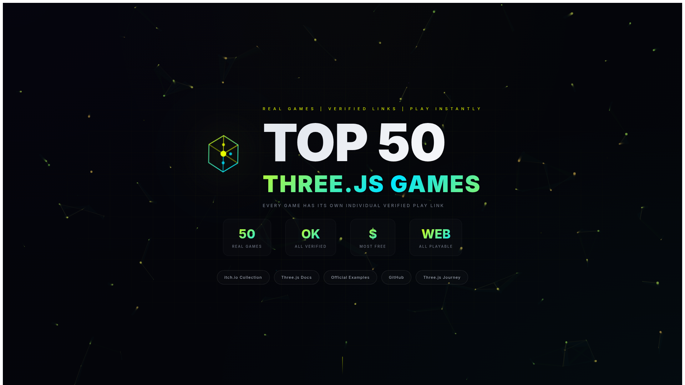
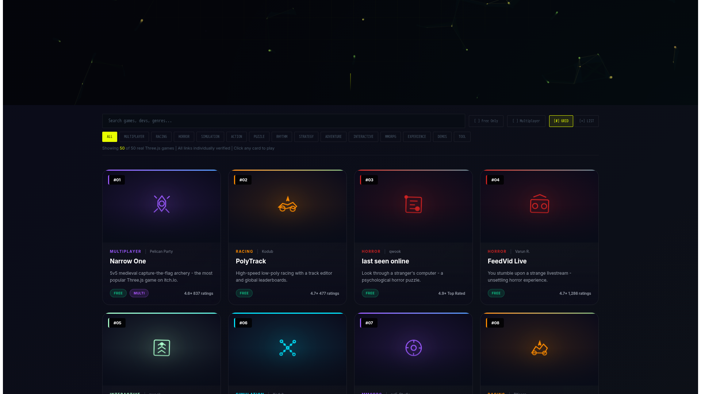
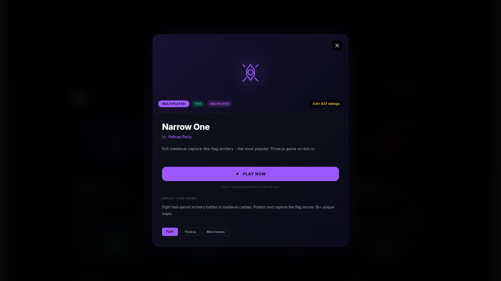
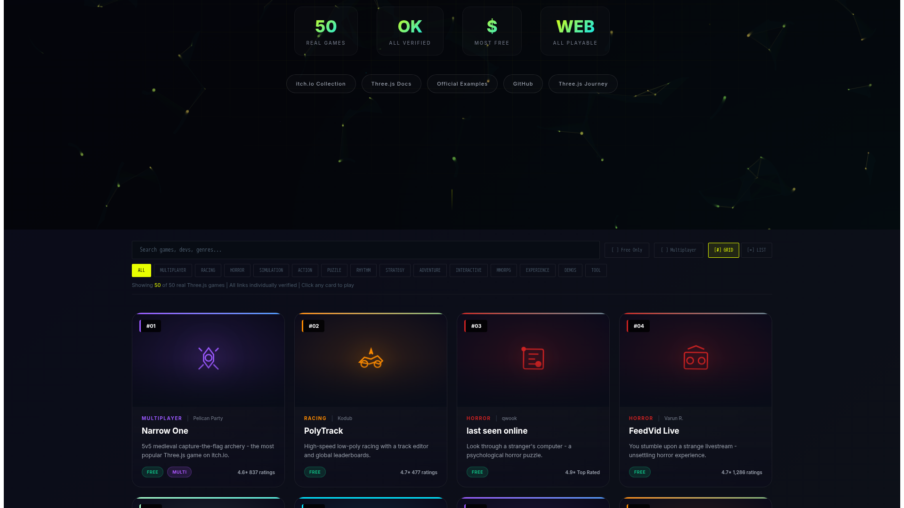
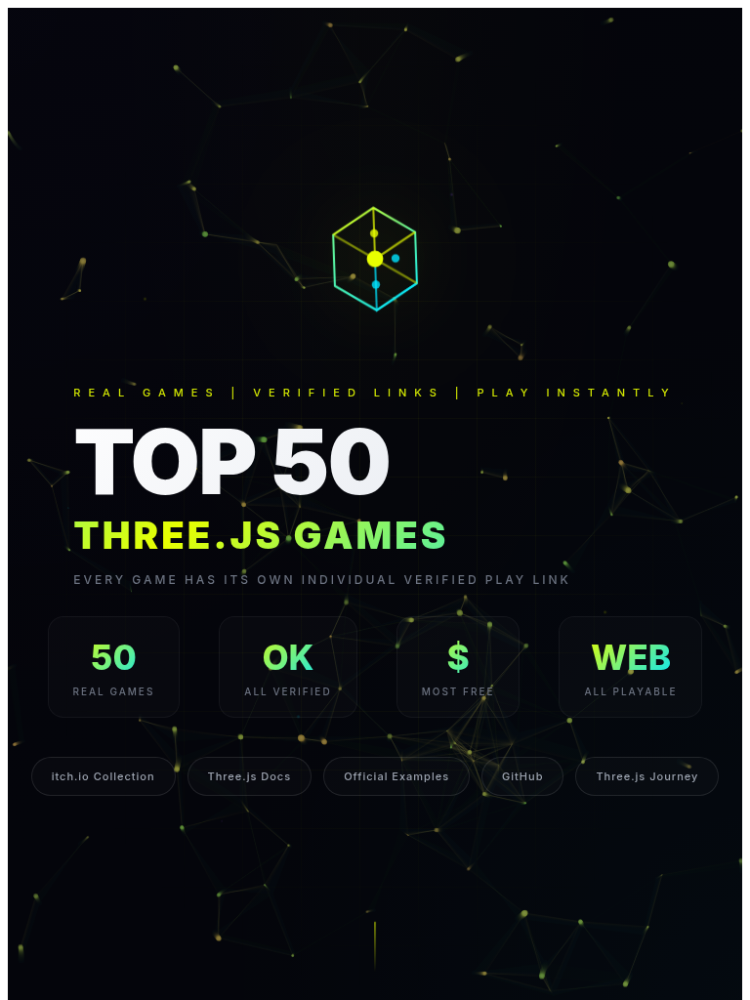
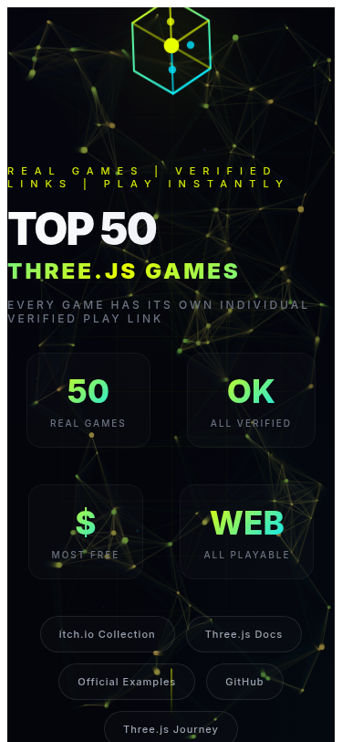

# Sample Games - Top 50 Three.js Games

<a href="https://sample-games.gateandtech.in" target="_blank">
  
</a>

<p align="center">
  <a href="https://sample-games.gateandtech.in" target="_blank">🎮 Live Demo</a>
  •
  <a href="#features">✨ Features</a>
  •
  <a href="#getting-started">🚀 Getting Started</a>
  •
  <a href="#contributing">🤝 Contributing</a>
</p>

<p align="center">
  
  
  
  
  
</p>

---

## 🎬 Demo Screenshots

### Desktop View

<table>
  <tr>
    <td></td>
    <td></td>
  </tr>
  <tr>
    <td align="center"><b>Hero Section</b></td>
    <td align="center"><b>Games Grid</b></td>
  </tr>
  <tr>
    <td></td>
    <td></td>
  </tr>
  <tr>
    <td align="center"><b>Game Details Modal</b></td>
    <td align="center"><b>Category Filtering</b></td>
  </tr>
</table>

### Responsive Design

<table>
  <tr>
    <td align="center">
      <br>
      <b>Tablet (768px)</b>
    </td>
    <td align="center">
      <br>
      <b>Mobile (375px)</b>
    </td>
  </tr>
</table>

---

## ✨ Features

### 🎮 Game Collection
- **50 curated Three.js games** - All games verified and playable
- **Multiple categories** - Multiplayer, Racing, Horror, Simulation, Action, Puzzle, and more
- **Search functionality** - Find games by name, developer, or category
- **Filters** - Free/Paid, Multiplayer options

### 🎨 Modern UI/UX
- **Glassmorphism design** - Modern frosted glass effects
- **Animated particle background** - Interactive mouse-responsive particles
- **Custom SVG icons** - Unique icon for each game
- **Smooth animations** - CSS transitions and keyframe animations
- **Responsive layout** - Works on desktop, tablet, and mobile

### 🛠️ Technical Features
- **Vue.js 3** - Composition API with `<script setup>`
- **TypeScript** - Full type safety
- **Vite** - Lightning fast development and build
- **Cloudflare Pages** - Global CDN deployment

---

## 🚀 Getting Started

### Prerequisites

- Node.js 18+
- npm or yarn

### Installation

```bash
# Clone the repository
git clone https://github.com/Patel230/sample-games.git

# Navigate to project directory
cd sample-games

# Install dependencies
npm install

# Start development server
npm run dev
```

### Build for Production

```bash
npm run build
```

### Deploy

```bash
npm run deploy
```

---

## 📁 Project Structure

```
sample-games/
├── public/
│   ├── _headers           # Cloudflare headers
│   ├── logo.svg           # Site logo
│   └── screenshot*.png    # Documentation screenshots
├── src/
│   ├── App.vue           # Main application component
│   ├── main.ts           # Application entry point
│   ├── env.d.ts          # TypeScript declarations
│   ├── index.css         # Global styles
│   └── assets/           # Static assets
├── index.html
├── package.json
├── tsconfig.json
├── vite.config.ts
└── wrangler.toml         # Cloudflare config
```

---

## 🎯 Game Categories

| Category | Count | Examples |
|----------|-------|----------|
| Multiplayer | 5+ | Narrow One, Star Defenders 3D, Goblin.Life |
| Racing | 4+ | PolyTrack, HexGL, Bogus Roads |
| Horror | 3+ | last seen online, FeedVid Live |
| Simulation | 10+ | DustSim, Three.js Ocean, GPGPU Birds |
| Action | 5+ | HelloRun, Dungeon Survivors |
| Puzzle | 5+ | cubing.js, Laputa: Riddles |
| Experience | 3+ | Bruno Simon Portfolio, ro.me |
| Demos | 10+ | Three.js Official Examples |

---

## 🤝 Contributing

Contributions are welcome! Please feel free to submit a Pull Request.

1. Fork the repository
2. Create your feature branch (`git checkout -b feature/AmazingFeature`)
3. Commit your changes (`git commit -m 'Add some AmazingFeature'`)
4. Push to the branch (`git push origin feature/AmazingFeature`)
5. Open a Pull Request

See [CONTRIBUTING.md](CONTRIBUTING.md) for more details.

---

## 📝 License

This project is licensed under the MIT License - see the [LICENSE](LICENSE) file for details.

---

## 🙏 Acknowledgments

- All game developers featured in this collection
- [Three.js](https://threejs.org/) community
- [itch.io](https://itch.io/) for hosting indie games
- All open source contributors

---

## ⚠️ Disclaimer

This is an unofficial fan site. All game content belongs to their respective owners. This project is not affiliated with Three.js, itch.io, or any of the game developers featured.

---

<p align="center">
  Made with ❤️ for the Three.js community
</p>

<p align="center">
  <a href="https://sample-games.gateandtech.in" target="_blank">
    
  </a>
</p>
