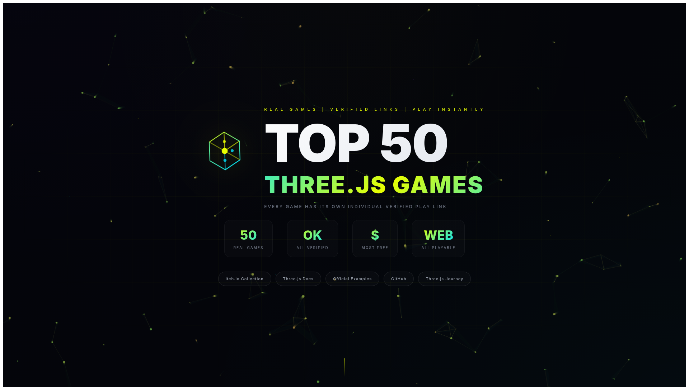

# Sample Games - Top 50 Three.js Games

A curated collection of the best Three.js games, demos, and experiences. All games are verified and playable directly in the browser.




## Features

- 50 curated Three.js games and demos
- Category filtering (Multiplayer, Racing, Horror, Simulation, etc.)
- Search by name, developer, category
- Free/Paid filter
- Grid/List view toggle
- Animated particle background
- Modern glassmorphism UI
- Fully responsive design
- Custom SVG icons for each game

## Tech Stack

- **Framework**: Vue.js 3 with Composition API
- **Language**: TypeScript
- **Build Tool**: Vite
- **Styling**: CSS with modern features (gradients, animations, glassmorphism)
- **Deployment**: Cloudflare Pages

## Getting Started

### Prerequisites

- Node.js 18+
- npm or yarn

### Installation

```bash
# Clone the repository
git clone https://github.com/yourusername/sample-games.git

# Navigate to project directory
cd sample-games

# Install dependencies
npm install

# Start development server
npm run dev
```

### Build for Production

```bash
npm run build
```

### Deploy

```bash
npm run deploy
```

## Project Structure

```
sample-games/
├── public/
│   ├── _headers
│   └── logo.svg
├── src/
│   ├── App.vue          # Main application component
│   ├── main.ts          # Application entry point
│   ├── env.d.ts         # TypeScript declarations
│   ├── index.css        # Global styles
│   └── assets/
├── index.html
├── package.json
├── tsconfig.json
├── vite.config.ts
└── wrangler.toml
```

## Game Categories

- Multiplayer
- Racing
- Horror
- Simulation
- Action
- Puzzle
- Rhythm
- Strategy
- Adventure
- Interactive
- MMORPG
- Experience
- Demos
- Tool

## Contributing

Contributions are welcome! Please feel free to submit a Pull Request.

1. Fork the repository
2. Create your feature branch (`git checkout -b feature/AmazingFeature`)
3. Commit your changes (`git commit -m 'Add some AmazingFeature'`)
4. Push to the branch (`git push origin feature/AmazingFeature`)
5. Open a Pull Request

## License

This project is licensed under the MIT License - see the [LICENSE](LICENSE) file for details.

## Acknowledgments

- All game developers featured in this collection
- [Three.js](https://threejs.org/) community
- [itch.io](https://itch.io/) for hosting indie games
- All open source contributors

## Disclaimer

This is an unofficial fan site. All game content belongs to their respective owners. This project is not affiliated with Three.js, itch.io, or any of the game developers featured.

---

Made with love for the Three.js community
